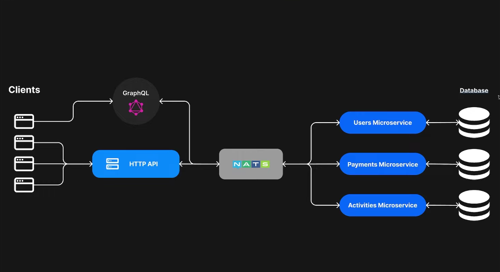

```sh
mysql -u testuser -p
use nestjs_db;
show tables;
```

```sh
CREATE PAYMENT (price, userID) -> PAYMENT SERVICE
PAYMENT SERVICE (userId) -> USER SERVICE
PAYMENT SERVICE (userId) -> EMIT ("CREATE_PAYMENT")
"CREATE_PAYMENT" -> USER_SERVICE
```
